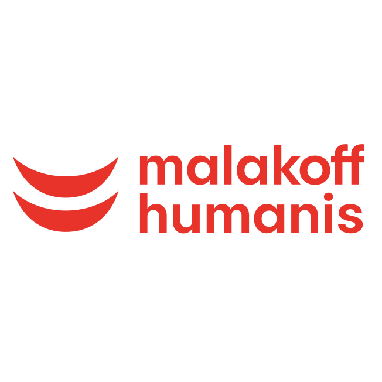
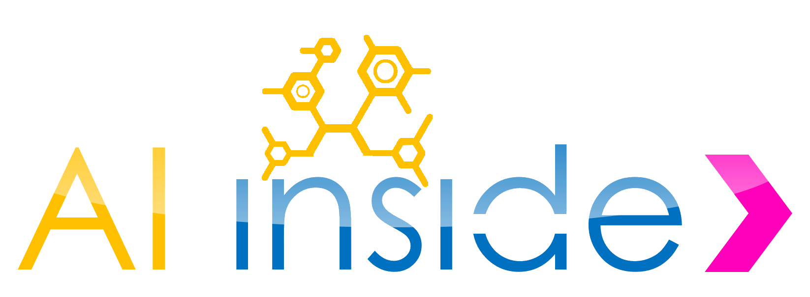
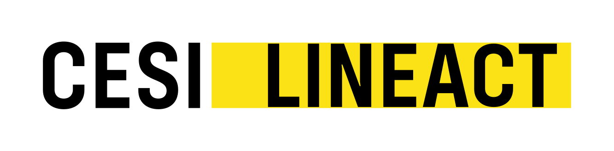

# 👋 Hi, I'm Achraf Jaanine

## 🚀 About Me

AI Engineer & Data Scientist specialized in **Generative AI, RAG, Document AI, and LLM Systems**.

I design and deploy **end-to-end AI solutions**, from data ingestion and modeling to backend integration and production deployment.  
I enjoy working on complex, ambiguous problems and building robust systems with strong business impact.

📍 Based in Paris, France — Open to AI / ML opportunities in Europe

---

## 🧠 Skills & Technologies

### 🤖 Machine Learning, Deep Learning & AI

  
  
  
  
  

---

### 🧠 Generative AI, RAG & LLM Systems

  
  
  
  

---

### 💻 Software Engineering & Backend

  

---

### 🗄️ Databases, Search & Data

  
  

---

### ☁️ Cloud, MLOps & Analytics

  
  
  
  

---

## 💼 Professional Experience

### 🏦 Malakoff Humanis — Data Scientist  

- Designed and deployed end-to-end Document AI pipelines for insurance workflows  
- Automated extraction of structured data from complex dental documents  
- Built OCR pipelines with table detection, text recognition, and normalization  
- Fine-tuned deep learning models for document understanding  
- Led annotation workflows using active learning strategies  
- Generated synthetic and LLM-based training data  

**Tech:** PyTorch, YOLO, PaddleOCR, TrOCR, AWS, Dataiku, Label Studio, OpenAI API

---

### 🏭 AI Inside Private — AI Engineer  

- Developed few-shot and one-shot learning models for industrial part recognition  
- Implemented Siamese Networks for visual similarity learning  
- Designed and deployed inference APIs  
- Built web interfaces for model training and prediction  
- Integrated ML pipelines into production systems  

**Tech:** PyTorch, OpenCV, Django REST, Vue.js

---

### 🔬 CESI Lineact — VR Developer  

- Developed a Virtual Reality application for dental anatomy learning  
- Designed immersive and interactive training environments  
- Implemented automated quiz generation for knowledge assessment  
- Integrated AI-based content generation into learning workflows  
- Collaborated with researchers and domain experts  

**Tech:** Unity, C#, VR SDKs, AI-based systems

---

## 🎓 Education

🎓 MSc — Machine Learning for Data Science — Université Paris Cité  
🎓 Engineering Degree — AI & Data Science — ENSAM / CESI

---

## 🚀 Engineering Strengths

✔️ End-to-end AI systems  
✔️ Production deployment mindset  
✔️ Scalable architectures  
✔️ Evaluation-driven development  
✔️ Reproducible pipelines  
✔️ Business-oriented ML

---

## 📈 Current Focus

- Advanced RAG & AI Agents  
- LLM evaluation frameworks  
- Cloud-native ML systems  
- MLOps automation

---

## 📫 Contact

  

  

---

⭐️ Feel free to explore my pinned projects below
