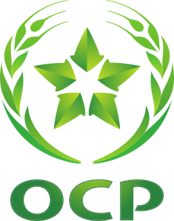
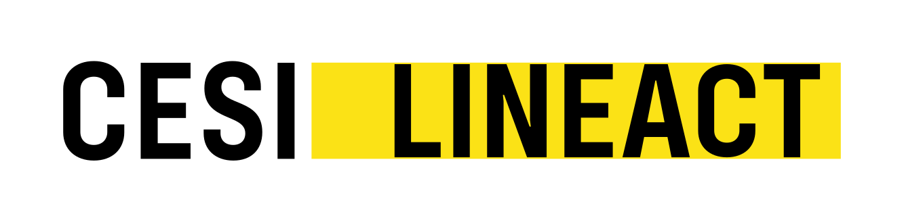
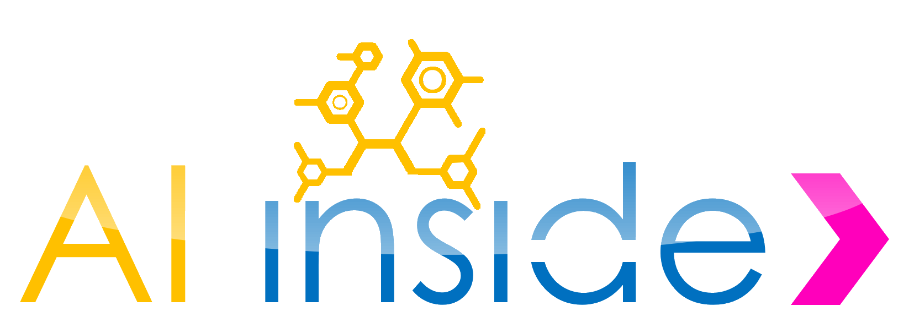

 

---

**AI Engineer based in Paris.** I build LLM systems that make it to production: retrieval pipelines, AI agents, document understanding, and the evaluation layer that tells you whether any of it is actually right.

- 🔭 Co-creating **Appelo**, a GenAI platform for French public procurement responses
- 🧠 Into retrieval quality, agent orchestration, and evaluation methodology
- 🛠️ Comfortable from data ingestion to deployment, backend and MLOps included
- 🌍 Open to AI / ML Engineer roles across Europe
- 🗣️ Français, English, العربية

## ⚡ Stack

### 🧠 GenAI, RAG & LLM Systems

  
  
  
  
  
  
  
  
  
  
  
  
  

### 🤖 Machine Learning & Deep Learning

  
  
  
  
  
  
  
  

### 👁️ Computer Vision & Document AI

  
  
  
  
  
  
  

### 💻 Software Engineering & Backend

  
  
  
  
  
  
  
  
  
  
  
  
  

### 🗄️ Databases & Search

  
  
  
  
  

### ☁️ Cloud, MLOps & Monitoring

  
  
  
  
  
  
  
  
  
  

## 🔨 What I'm building

**Appelo** · a GenAI platform that drafts responses to French public tenders from a company's own knowledge base

Hybrid retrieval, vector plus knowledge graph. A/B on identical corpus and embeddings: **+15 pts fact recall** on hard questions. Evaluated on 250 hand-annotated Q/A, with a validation set the iteration loop never sees. **RAGAS faithfulness 0.92**, p50 latency **5.8 s**.

My favourite bug so far: the ingestion layer was silently deduplicating documents and dropping their text chunks. Fact recall went 0.26 → 0.75 once traced and patched.

`LightRAG` `LangGraph` `RAGAS` `MinerU` `FastAPI` `OpenRouter` `Docker`

## 🧰 Side projects

| Project | What it is | Signal |
|---|---|---|
| **[groovemind](https://github.com/JAANINEACHRAF/GrooveMind)** | Music recommendation on CLAP audio embeddings | Multimodal embeddings, end to end |
| **company-brief-agents** *(private)* | Multi-agent company intelligence briefs, LangGraph | Agent orchestration in practice |

## 🧪 Also shipped

<table>
<tr>
<td width="25%" align="center" valign="top">

  
<b>Document AI, insurance</b>
 
Dental quote extraction YOLO + LayoutLM + OCR
  
<b>full estimate in 23 s</b>
</td>
<td width="25%" align="center" valign="top">

  
<b>Real-time PPE detection</b>
 
YOLOv5 on live video HSE compliance
  
<b>89% mAP@50 at 32 FPS</b>
</td>
<td width="25%" align="center" valign="top">

  
<b>Multimodal RAG + VR</b>
 
Serverless on ECS Fargate Chainlit interface
  
<b>event-driven PDF ingestion</b>
</td>
<td width="25%" align="center" valign="top">

  
<b>One-shot part recognition</b>
 
Siamese Networks contrastive + triplet loss
  
<b>72 images augmented to 400+</b>
</td>
</tr>
</table>

## 🎓 Academic background

<table>
<tr>
<td width="90" align="center"></td>
<td><b>Université Paris Cité</b> MSc Machine Learning for Data Science · apprenticeship · 2024 → 2025</td>
</tr>
<tr>
<td width="90" align="center"></td>
<td><b>ENSAM Meknès</b> Engineering Degree in AI & Data Science · 2019 → 2024</td>
</tr>
</table>

---

Working on something with retrieval, agents or documents that has to actually work? <a href="https://www.linkedin.com/in/achraf-jaanine/">Say hi.</a>

